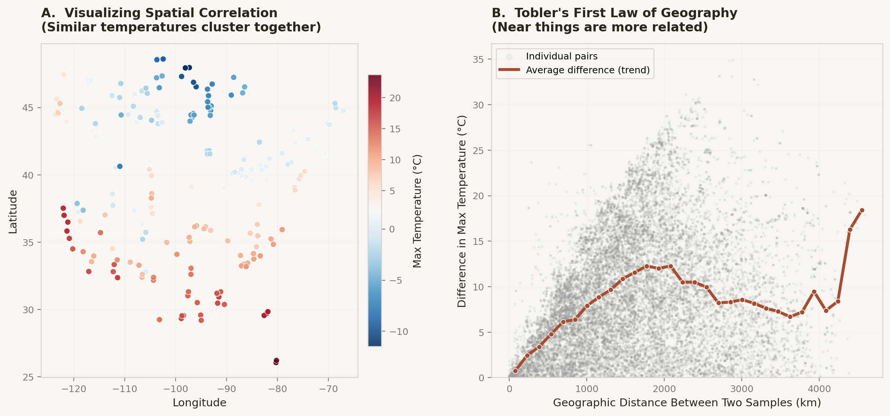

# Spatially Aware CatBoost Model for Predicting *Listeria* Presence in Soil

**Team:** Decaying β-Amyloid  
**Competition:** IAFP AI Benchmarking: Student AI Benchmark Competition on Predictive Food Safety Models  
**Track:** GIS-based pathogen presence prediction (*Listeria* in soil)  
**License:** MIT

---

## Project Overview

This repository implements a binary classification pipeline to predict whether *Listeria* spp. are present in U.S. soil samples. The model uses soil chemistry, climate, land-use, and geographic features to output a per-sample risk probability, enabling public health agencies and food safety programs to prioritize environmental sampling locations.

The primary model is a **CatBoost** gradient-boosted decision tree, evaluated under a **spatially aware cross-validation protocol** that mitigates geographic data leakage. A **logistic regression baseline** (`lr_baseline.py`) is included to demonstrate that the nonlinear capacity of CatBoost is justified, not merely an artefact of model complexity.

---

## Motivation and Background

Environmental *Listeria* surveillance across the U.S. generates high-dimensional geospatial data. Because soil properties and climate variables are spatially autocorrelated (nearby locations tend to have similar measurements), standard random train/test splits can overstate predictive performance by allowing the model to train on geographic neighbours of test points (spatial leakage).

**Figure: Spatial Autocorrelation in the Dataset**



*Panel A shows sampling sites colored by maximum temperature, illustrating that similar values cluster geographically. Panel B plots the pairwise geographic distance between all sample pairs against the absolute difference in max temperature: the rising trend line confirms Tobler's First Law of Geography ("near things are more related"). This spatial autocorrelation motivates the grid-based spatial cross-validation strategy used throughout this project.*

This project addresses that challenge by grouping samples into 0.25° latitude/longitude grid cells and applying `StratifiedGroupKFold`, ensuring that no grid cell appears in both the training and validation sets within the same fold.

---

## Repository Structure

```
Listeria-CatBoost-Predictor/
│
├── final_1.ipynb                          # Main submission notebook (CatBoost pipeline)
├── data_trial.ipynb                       # Exploratory development notebook
├── grid_sensitivity_matched.py            # Grid sensitivity analysis (0.25°, 0.50°, 1.00°)
├── lr_baseline.py                         # Logistic regression baseline (locked spatial protocol)
│
├── outputs_submission/                    # Locked submission outputs
│   ├── eval_lock.json                     #   Locked CV/threshold configuration
│   ├── overall_metrics.json               #   Pooled OOF benchmark metrics
│   ├── versions.json                      #   Python package versions
│   ├── catboost_fullfit.cbm               #   Full-data CatBoost model artifact
│   ├── feature_importance.csv             #   Feature importances
│   ├── oof_predictions.csv                #   Out-of-fold predictions
│   ├── cv_fold_metrics_threshold_0p5.csv  #   Fold-level metrics (t = 0.5)
│   ├── cv_fold_metrics_threshold_tuned.csv#   Fold-level metrics (F1-tuned threshold)
│   ├── fig_1_feature_importance.png       #   Figure 1: top feature importances
│   └── fig_2_panel_roc_pr_cm_calibration.png  # Figure 2: ROC, PR, CM, calibration
│
├── outputs_grid_sensitivity_matched_protocol/  # Grid sensitivity experiment outputs
│   ├── grid_sensitivity_chart.png
│   ├── grid_sensitivity_compact.csv
│   ├── grid_sensitivity_fold_metrics.csv
│   ├── grid_sensitivity_full.csv
│   ├── grid_sensitivity_full.json
│   ├── matched_protocol_config.json
│   └── oof_predictions_grid{0.25,0.50,1.00}deg.csv
│
├── fig_spatial_autocorrelation.png        # Spatial autocorrelation figure
├── generate_autocorrelation.py            # Script to produce the autocorrelation figure
│
├── AI benchmarking_Listeria_Deacying beta-amyloid.pdf  # Report / presentation
├── EXPERIMENTS.md                         # Full experimental log
├── LICENSE                                # MIT License
└── README.md                              # This file
```

---

## Data Description

**Primary dataset:** `ListeriaSoil_clean.csv` (623 samples × 34 predictor columns + 1 outcome column)  
**Metadata dictionary:** `ListeriaSoil_Metadata.csv`

| Category | Features | Examples |
|---|---|---|
| Geographic | 3 | Latitude, Longitude, Elevation (m) |
| Soil chemistry | 14 | pH, Moisture, Total nitrogen (%), Sodium (mg/Kg), Calcium (mg/Kg), … |
| Climate | 4 | Precipitation (mm), Max temperature (°C), Min temperature (°C), Wind speed (m/s) |
| Land use / land cover | 9 | Forest (%), Cropland (%), Wetland (%), Developed open space (%), … |
| **Outcome** | 1 | `Number of Listeria isolates obtained` |

**Binary label definition:**  
- `y = 1` if isolates > 0 (Listeria present)  
- `y = 0` otherwise  

Class balance is approximately 50/50.

**Source:** Cornell Food Safety ML Repository, "Listeria in soil."  
Primary citation: Liao, J., Guo, X., Weller, D. L., et al. (2021). Nationwide genomic atlas of soil-dwelling *Listeria* reveals effects of selection and population ecology on pangenome evolution. *Nature Microbiology*, 6, 1021–1030. [https://doi.org/10.1038/s41564-021-00935-7](https://doi.org/10.1038/s41564-021-00935-7)

---

## Methods and Models

### Locked Evaluation Protocol

All primary results use a locked configuration stored in `outputs_submission/eval_lock.json`:

| Parameter | Value |
|---|---|
| Cross-validation | `StratifiedGroupKFold` |
| Spatial grid | 0.25° lat/lon cells (~210 groups) |
| Folds | 5 |
| Seed | 42 |
| Threshold policy | Maximize F1 on pooled out-of-fold (OOF) predictions |
| Locked threshold | 0.475 |

### CatBoost (Primary Model)

CatBoost is a gradient-boosted decision tree algorithm well suited for tabular data with mixed feature types. Key hyperparameters (from `grid_sensitivity_matched.py`):

- Iterations: 20,000 (with early stopping, patience = 300)
- Learning rate: 0.03
- Depth: 8
- L2 leaf regularization: 3.0
- Loss: Logloss; Eval metric: AUC

### Logistic Regression Baseline (`lr_baseline.py`)

A logistic regression model serves as a linear baseline to justify the use of CatBoost:

- Solver: L-BFGS with L2 penalty (`C = 1.0`)
- Preprocessing: `StandardScaler` (fit on train fold, transform on validation fold)
- Same locked spatial CV protocol as CatBoost (StratifiedGroupKFold, 0.25° grid, 5 folds)
- Evaluated at both the locked threshold (0.475) and its own F1-optimized threshold (0.340)

### Role of CatBoost vs. Logistic Regression

The logistic regression baseline is not intended as a competing model. Its purpose is to **validate that CatBoost's additional complexity is justified** by the data. Under the identical locked spatial protocol:

| Metric | Logistic Regression | CatBoost | Δ |
|---|---:|---:|---|
| ROC AUC | 0.803 | 0.936 | +13 pts |
| PR AUC | 0.747 | 0.932 | +19 pts |
| F1 (t = 0.475) | 0.753 | 0.872 | +12 pts |
| Brier Score | 0.182 | 0.101 | -45% |
| F1 (opt. threshold) | 0.778 | 0.872 | +9 pts |

The large, consistent gap across all metrics confirms that nonlinear feature interactions captured by gradient boosting provide substantial predictive value beyond what a linear model can extract from the same features.

### Grid Sensitivity Analysis (`grid_sensitivity_matched.py`)

To assess whether results are robust to the choice of spatial grid resolution, CatBoost was evaluated at three grid sizes under an otherwise identical protocol:

| Grid (°) | ROC AUC | F1 (t = 0.475) | F1 (tuned t) |
|---:|---:|---:|---:|
| 0.25 | 0.936 | 0.872 | 0.872 |
| 0.50 | 0.934 | 0.880 | 0.880 |
| 1.00 | 0.928 | 0.872 | 0.876 |

Performance is stable across grid sizes, with a modest decline at 1.00° where larger held-out regions create more distribution shift.

---

## Final Benchmark Results (Locked Protocol)

Source: `outputs_submission/overall_metrics.json`

| Metric | Mean ± SD |
|---|---:|
| ROC AUC | 0.936 ± 0.022 |
| PR AUC | 0.932 ± 0.027 |
| F1 | 0.872 ± 0.035 |
| Sensitivity | 0.897 ± 0.036 |
| Specificity | 0.839 ± 0.040 |
| Locked threshold (F1-optimized) | 0.475 |

### Calibration and Actionability

Isotonic calibration improved probability accuracy (Brier score: 0.1008 → 0.0945).

Capacity-based sampling enrichment using calibrated risk scores:

| Risk percentile | Observed positivity |
|---|---|
| Top 10% | 98.4% (vs. 50.0% overall) |
| Top 20% | 96.8% |
| Top 30% | 95.2% |

---

## Figures

### Figure 1: Feature Importances (Top 10)


Sodium concentration is the dominant predictor, followed by Molybdenum, Moisture, and Copper. Geographic coordinates (Latitude, Longitude) also contribute, consistent with spatial structuring of *Listeria* prevalence.

### Figure 2: ROC, PR, Confusion Matrix, and Calibration


### Figure 3: Spatial Autocorrelation


*Panel A maps sampling locations colored by maximum temperature, showing clear geographic clustering of environmental conditions. Panel B quantifies this pattern: as geographic distance between sample pairs increases, their temperature difference also increases on average (red trend line). This spatial autocorrelation justifies the use of spatial cross-validation over standard random splits.*

---

## Usage Instructions

### System Requirements

- Tested on: Intel i7 / AMD Ryzen 7 (8 cores), 16 GB RAM
- Minimum: 4 cores, 8 GB RAM
- Disk: < 200 MB for artifacts (dataset stored separately)
- GPU: Not required (CPU-only)

### Environment

Package versions are recorded in `outputs_submission/versions.json`:

```
pandas==1.4.2   numpy==1.22.3   scikit-learn==1.7.2
```

CatBoost must also be installed (`pip install catboost`).

### Running the Pipeline

1. Place dataset files in the repository root:
   - `ListeriaSoil_clean.csv`
   - `ListeriaSoil_Metadata.csv`

2. **Main submission benchmark:**
   ```bash
   jupyter nbconvert --execute final_1.ipynb
   ```
   Outputs are written to `outputs_submission/`.

3. **Logistic regression baseline:**
   ```bash
   python lr_baseline.py
   ```
   Prints pooled OOF metrics and a side-by-side summary versus CatBoost.

4. **Grid sensitivity analysis:**
   ```bash
   python grid_sensitivity_matched.py
   ```
   Requires `outputs_submission/eval_lock.json` (produced by step 2). Outputs are written to `outputs_grid_sensitivity_matched_protocol/`.

5. **Autocorrelation figure:**
   ```bash
   python generate_autocorrelation.py
   ```
   Produces `fig_spatial_autocorrelation.png`.

---

## Outputs

| File / Directory | Contents |
|---|---|
| `outputs_submission/overall_metrics.json` | Locked benchmark metrics (ROC AUC, PR AUC, F1, etc.) |
| `outputs_submission/eval_lock.json` | Locked CV/threshold/seed configuration |
| `outputs_submission/catboost_fullfit.cbm` | CatBoost model trained on all data |
| `outputs_submission/oof_predictions.csv` | Out-of-fold probability predictions |
| `outputs_submission/feature_importance.csv` | Feature importance scores |
| `outputs_submission/fig_1_feature_importance.png` | Top-10 feature importance chart |
| `outputs_submission/fig_2_panel_roc_pr_cm_calibration.png` | ROC, PR, confusion matrix, calibration |
| `outputs_grid_sensitivity_matched_protocol/` | Grid sensitivity results and chart |
| `fig_spatial_autocorrelation.png` | Spatial autocorrelation two-panel figure |

---

## Limitations and Notes

- **Dataset scope:** The model is trained on a single published dataset from the Cornell Food Safety ML Repository. Generalization to other geographic regions or sampling campaigns is untested.
- **No external validation set:** All reported metrics are from spatial cross-validation on the same dataset. True out-of-sample performance may differ.
- **Temporal dimension not modeled:** The dataset does not include sampling dates; temporal autocorrelation is not addressed.
- **Hyperparameter selection:** CatBoost hyperparameters appear to have been selected during development (possibly via `data_trial.ipynb`) but the search procedure is not documented in the repository. The locked protocol fixes these values for reproducibility.
- **Notebook execution order:** `grid_sensitivity_matched.py` depends on `outputs_submission/eval_lock.json`, which is produced by `final_1.ipynb`. Run the notebook first.

---

## Citation

If you use this work, please cite the primary data source:

> Liao, J., Guo, X., Weller, D. L., et al. (2021). Nationwide genomic atlas of soil-dwelling *Listeria* reveals effects of selection and population ecology on pangenome evolution. *Nature Microbiology*, 6, 1021–1030. [https://doi.org/10.1038/s41564-021-00935-7](https://doi.org/10.1038/s41564-021-00935-7)
