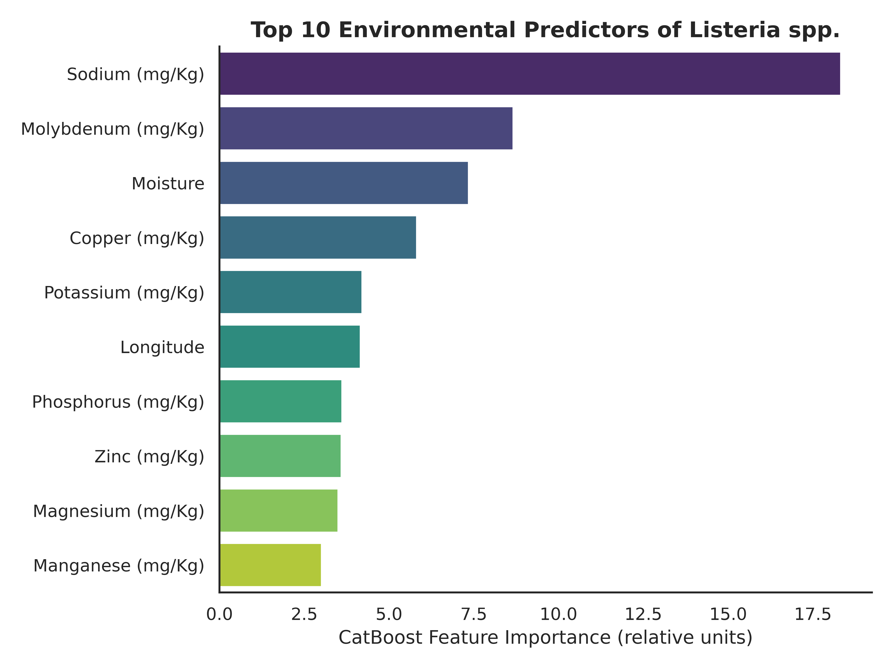
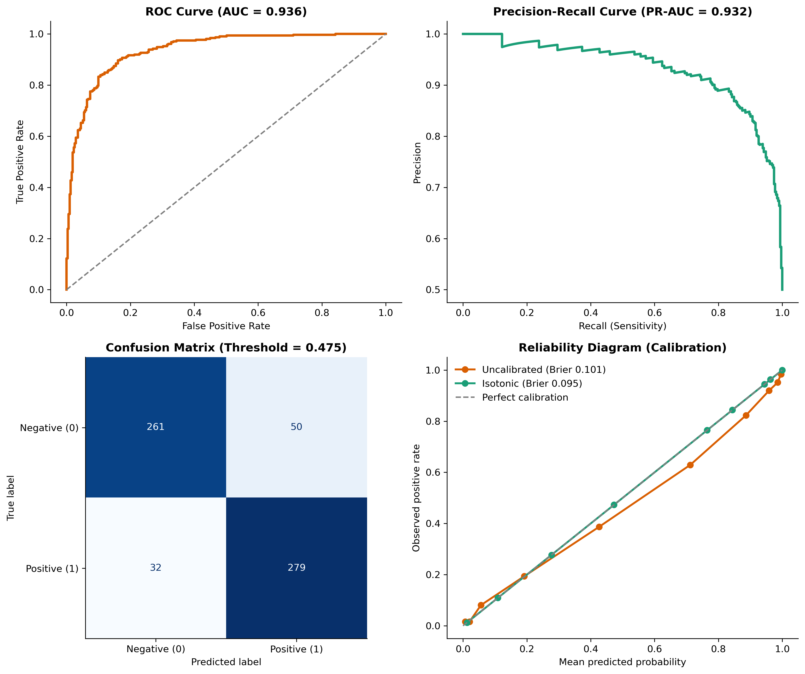

# Spatially Aware CatBoost Model for Predicting Listeria Presence in Soil

**Team:** Decaying β-Amyloid  
**Competition:** IAFP AI Benchmarking Student Competition on Predictive Food Safety Models  
**Track:** GIS-based pathogen presence prediction (Listeria in soil)

## Overview
This repository contains an end-to-end machine learning pipeline to predict the presence of *Listeria* spp. in U.S. soil samples using soil physicochemical properties, climate variables, land-use composition, and geographic coordinates.

Key design choices:
- Spatially aware cross-validation to reduce spatial leakage
- CatBoostClassifier for tabular modeling
- Probability calibration (isotonic regression) to produce an operational risk score
- Threshold tuning using out-of-fold (OOF) predictions

## Dataset and citation
Dataset: "Listeria in soil" from the Cornell Food Safety ML Repository.

Primary source publication:
- Liao, J., Guo, X., Weller, D.L. et al. (2021) Nationwide genomic atlas of soil-dwelling *Listeria* reveals effects of selection and population ecology on pangenome evolution. *Nature Microbiology* 6, 1021–1030. https://doi.org/10.1038/s41564-021-00935-7

Files expected locally (not committed to this repo):
- `ListeriaSoil_clean.csv`
- `ListeriaSoil_Metadata.csv`

## Task definition
Outcome column: `Number of Listeria isolates obtained`  
Binary label:
- y = 1 if isolates obtained > 0
- y = 0 otherwise

## Locked evaluation protocol (submission benchmark)
To reduce overly optimistic evaluation due to spatial autocorrelation, we perform group-based spatial CV:
- CV: StratifiedGroupKFold
- Spatial grouping: latitude/longitude grid cells (0.25°)
- Folds: 5
- Seed: 42
- Threshold policy: maximize F1 on OOF predictions

The locked configuration is recorded in:
- `outputs_submission/eval_lock.json`

## Final benchmark results (locked protocol)
Metrics are computed from OOF predictions under the locked protocol and saved in:
- `outputs_submission/overall_metrics.json`

| Metric | Value |
|---|---:|
| ROC AUC | 0.936 |
| PR AUC | 0.932 |
| F1 | 0.872 |
| Sensitivity | 0.897 |
| Specificity | 0.839 |
| Locked threshold (F1-optimized) | 0.475 |

## Calibration and decision policy
We calibrate OOF probabilities using isotonic regression to produce a risk score suitable for screening and prioritization.
- Brier score improved: 0.1008 → 0.0945

Capacity-based sampling enrichment using calibrated risk score:
- Top 10% highest risk: 98.4% observed positivity (vs 50.0% overall)
- Top 20% highest risk: 96.8% observed positivity
- Top 30% highest risk: 95.2% observed positivity

## Figures
**Figure 1.** Top 10 feature importances  


**Figure 2.** ROC, PR, confusion matrix at locked threshold, and calibration curve  


## Reproducibility

### System requirements
- OS: Windows, Linux, macOS
- CPU: 4+ cores recommended
- RAM: 8 GB minimum (16 GB recommended)
- Disk: < 200 MB (data + outputs)

### Environment
Exact versions used during development are recorded in:
- `outputs_submission/versions.json`

Suggested install (adjust if your platform requires different pins):
```bash
pip install pandas numpy scikit-learn catboost matplotlib seaborn
